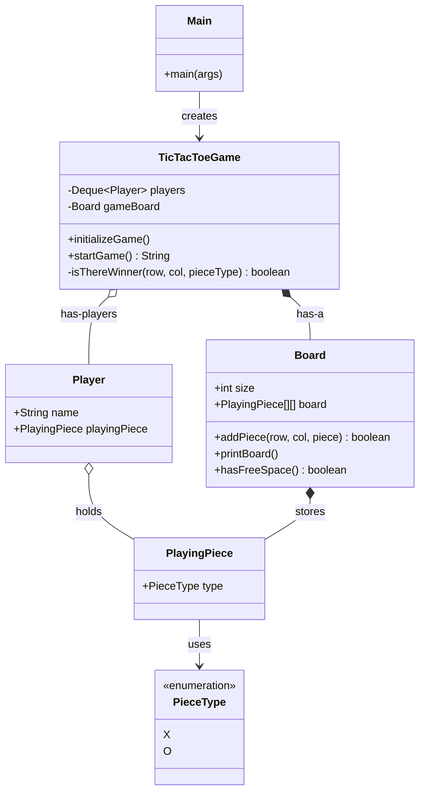

# Tic-Tac-Toe (Version 1: Basic)
This is a simple console-based Tic-Tac-Toe game built in Java.
**Logic:** All game flow logic is inside the TicTacToeGame class.
**Pattern:** No specific design patterns used yet (Monolithic logic).
**Features:** Supports 2 Human Players on a 3x3 Grid.

## Current Design (UML)
